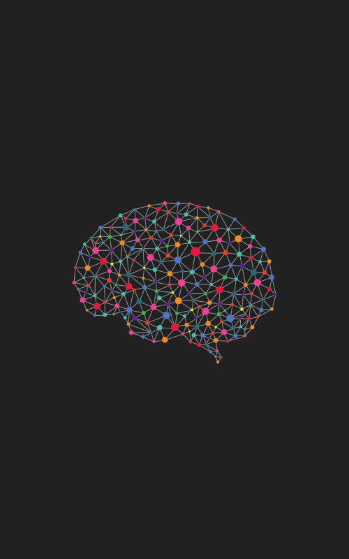

|                                                                                                                                                                                                                                              |                                                                                                                                                                                                                                                   |                                                                                                                                                                                                                                         |
| -------------------------------------------------------------------------------------------------------------------------------------------------------------------------------------------------------------------------------------------- | ------------------------------------------------------------------------------------------------------------------------------------------------------------------------------------------------------------------------------------------------- | --------------------------------------------------------------------------------------------------------------------------------------------------------------------------------------------------------------------------------------- |
|  [Info Visualization \| Dec 2018](https://vikram-bajaj.gitbook.io/cs-gy-6313-information-visualization)                  |  [Deep Learning \| May 2018](https://vikram-bajaj.gitbook.io/deep-learning-specialization-coursera/)                   |  [Machine Learning \| May 2018](https://vikram-bajaj.gitbook.io/cs-gy-6923-machine-learning/)                       |
|  [Corporate Finance \| May 2018](https://vikram-bajaj.gitbook.io/introduction-to-corporate-finance-coursera/) |  [Computer Vision \| Apr 2018](https://vikram-bajaj.gitbook.io/cs-gy-6643-computer-vision-and-scene-analysis/") |  [Database Systems \| Apr 2018](https://vikram-bajaj.gitbook.io/cs-gy-6083-principles-of-database-systems/) |
|  [Big Data \| Nov 2017](https://vikram-bajaj.gitbook.io/cs-gy-9223-d-programming-for-big-data/)                        |  [Algorithms \| Nov 2017](https://vikram-bajaj.gitbook.io/cs-gy-6033-i-design-and-analysis-of-algorithms-1/)   |                                                                                                                                                                                                                                         |

